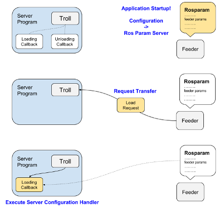
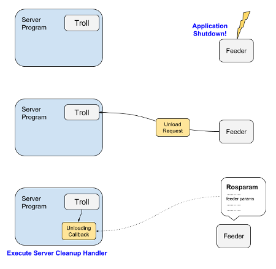

.. _feeders_and_trolls:

================
Trolls & Feeders
================

Trolls & Feeders are a means to transfer and manage configuration between
a continuously running subsystem and an application(s) that is free to start
up and be torn down.

If you're familiar with the way nodelet managers and nodelets work, then
the principle here is relatively similar, except that it deals with
configuration and not a runnable loop.

Feeders
=======

Application side programs that don't actually do anything except fire off the
services to load/unload configuration at startup/shutdown. Feeders
can fire off various kinds of configuration - ROSParam, Yaml (YAML > ROSParam
which is useful for some situations) and latched topics (a continuous update mechanism).
Right now, there is only support for the ROSParam style.

You shouldn't need to write your own feeders - just create a launcher,
point it at the feeder type you require and hook it up with a troll.

Trolls
======

Server side library that hooks up your program's custom server callbacks
(load/unload) to incoming requests from feeders.

The troll rescues you from the need to setup the underlying ROS mechanisms.
You simply need to register your custom callback methods with it.

Workflow
========

The basic flow for a ros parameter server enabled feeder-troll system.

**Feed the Troll**

**Unload the Troll**

Examples - Parameter Feeder
===========================

Setting up a feeder merely requires writing a launcher and yaml file (no coding necessary).
From the demo within this package:

.. literalinclude:: ../launch/demo_params_feeder.launch
   :language: xml

.. literalinclude:: ../parameters/demo_params.yaml
   :language: yaml

Examples - Server
=================

The server you will need to code yourself using the troll as a tool to quickly setup and integrate
the infrastructure. The demo example within this package does not do anything except redirect
the loaded/unloaded parameterisations to standard output, but anything is possible here.

.. literalinclude:: ../scripts/demo_param_server.py
   :language: python
   :lines: 18-66

And a launch file to kickstart it:

.. literalinclude:: ../launch/demo_params_server.launch
   :language: xml
